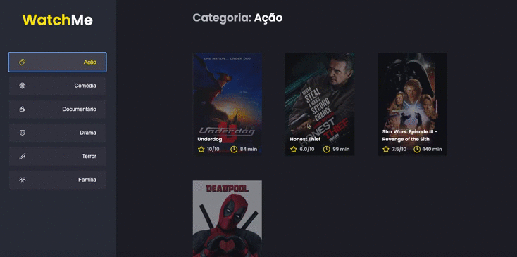

  

## 🚀 Technologies

This project was developed with the following technologies:

- [JSON Server](https://github.com/typicode/json-server)
- [ReactJS](https://reactjs.org/)
- [TypeScript](https://www.typescriptlang.org/)
- [Babel](https://babeljs.io/)
- [Webpack](https://webpack.js.org/)
- [Sass](https://sass-lang.com/)

## 💻  Getting started

_Before you run this application you need to make sure the `yarn server ` is running!_.

1. Clone this repo using `https://github.com/gustavonobrega/ignite-challenge-watchme`
2. Move to the appropriate directory: `cd ignite-challenge-watchme`. 
3. Run `yarn` to install dependencies. 
4. Run `yarn dev` to see the example app at `http://localhost:8080`.